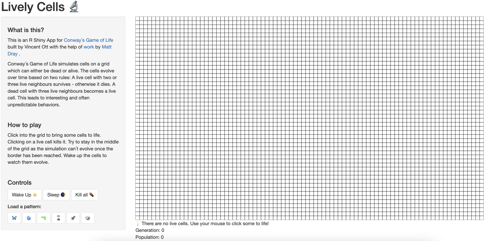

```{r, include = FALSE}
knitr::opts_chunk$set(
  collapse = TRUE,
  comment = "#>"
)
```

Welcome to the livelycells package!  
It lets you play Conway´s Game of Life in an R Shiny App.

The first step is to load the package.
```{r setup}
library(livelycells)
```

Next, use the package´s only function to start the app.
```{r eval=FALSE}
play()
```

The app looks like this - with a sidebar on the left and a grid on the right.
```{r out.width = '100%', echo = FALSE}

```


On the sidebar there are instructions and controls.
```{r out.width = '100%', echo = FALSE}
# screenshot instructions
# 

# screenshot controls
# 
```


The grid is where the fun happens! Here you can click cells to life with your mouse and also kill them again.
```{r out.width = '100%', echo = FALSE}
# screenshot grid
# 
```


Below the grid there is information about the current status of the Game  
comprising a statement, the current generation, and the current population.
```{r out.width = '100%', echo = FALSE}
# screenshot info below grid
# 
```


Once you brought some cells to life
```{r out.width = '100%', echo = FALSE}
# screenshot grid with pattern gen0 lower left to incl info below
# 
```

you can wake them up and watch them evolve.
```{r out.width = '100%', echo = FALSE}
# screenshot wake up button
# 
```

```{r out.width = '100%', echo = FALSE}
# screenshot pattern gen1 lower left to incl info below
# 
```


Make sure investigate how the stored patterns evolve!
```{r out.width = '100%', echo = FALSE}
# screenshot load pattern buttons
# 
```

```{r out.width = '100%', echo = FALSE}
# screenshot rocket
# 
```
