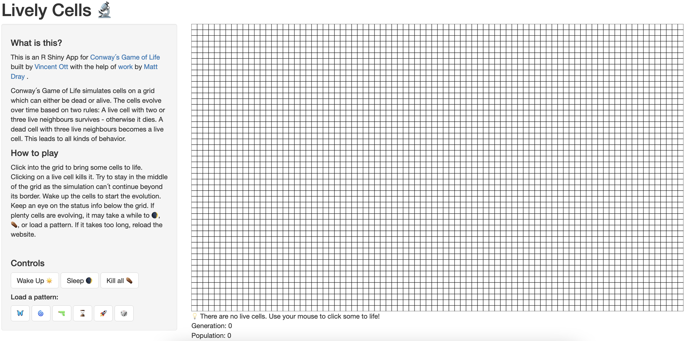
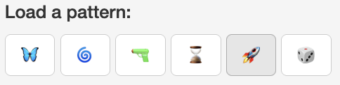

```{r, include = FALSE}
knitr::opts_chunk$set(
  collapse = TRUE,
  comment = "#>"
)
```
<br/>
Welcome to the livelycells package!  
It lets you play Conway´s Game of Life in an R Shiny App.  
<br/>
You can find more information about the game on its
[Wikipedia page](https://en.wikipedia.org/wiki/Conway's_Game_of_Life).  
<br/>
<br/>
The first step is to load the package.
```{r setup}
library(livelycells)
```
<br/>
<br/>
Next, use the package´s only function to start the app in your browser.
```{r eval=FALSE}
play()
```
<br/>
<br/>
The app looks like this - with a sidebar on the left and a grid on the right.
```{r out.width = '100%', echo = FALSE}

```
<br/>
<br/>
On the sidebar there are instructions...
<br/>
```{r out.width = '70%', echo = FALSE}

```
<br/>
...and controls.
<br/>
```{r out.width = '70%', echo = FALSE}

```
<br/>
<br/>
The grid is where the fun happens! Here you can click cells to life with your mouse and also kill them again.
<br/>
```{r out.width = '50%', echo = FALSE}

```

```{r out.width = '50%', echo = FALSE}

```

```{r out.width = '50%', echo = FALSE}

```
<br/>
<br/>
Below the grid there is information about the current status of the Game  
comprising a statement, the current generation, and the current population.
<br/>
```{r out.width = '50%', echo = FALSE}

```
<br/>
<br/>
Once you brought some cells to life...
<br/>
```{r out.width = '50%', echo = FALSE}

```
<br/>
<br/>
you can wake them up and watch them evolve...
<br/>
```{r out.width = '50%', echo = FALSE}

```

```{r out.width = '50%', echo = FALSE}

```
<br/>
<br/>
<br/>
Make sure investigate how these patterns evolve!
<br/>
```{r out.width = '70%', echo = FALSE}

```

```{r out.width = '70%', echo = FALSE}

```
